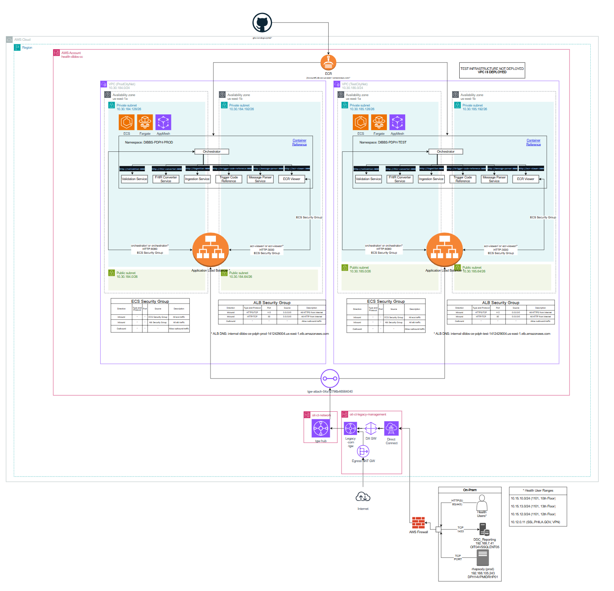

# About the Project

This repo handles the deployment of the Data Infrastructure Building Blocks infra to the PDPH DIBBS AWS Environment.

From the [DIBBS Documentation](https://github.com/CDCgov/dibbs-aws/tree/main):

> The Data Integration Building Blocks (DIBBs) project is an effort to help state, local, territorial, and tribal public health departments better make sense of and utilize their data. You can read more about the project on the main [DIBBs eCR Viewer repository](https://github.com/CDCgov/dibbs-ecr-viewer/blob/main/README.md).

# Getting Started


## Directory Structure:
```
|
| - .github/workflows
|       |- deploy.yml -- Defines Github Actions for the repo.  This runs the deployment workflow from GitHub Actions.
|
| - configs
|       |- prod.tfvars -- Defines variables for the production deployment of DIBBs
|       |- dev.tfvars -- Defines variables for the development deployment of DIBBs
| 
| - _variables.tf -- Defines variables for the deployment
|
| - main.tf -- defines the resources to deploy
| 
| - terraform-docs.MD -- programmaticly defined list of resources
| 
| - backend.tf -- Defines the terraform backend
|
```

## Infrastructure Diagram:



# Usage

## Deployment:

Deployment for all of the DIBBS infrastructure is handled through [Github Actions](https://docs.github.com/en/actions/about-github-actions/understanding-github-actions).

To deploy:
- Navigate to [Github Actions](https://github.com/PDPH-HUB/dibbs-aws/actions)
- Select the `Terraform (Plan||Apply||Destroy)` workflow
- Find the `Run workflow`
- Select the following:
    - `Branch` -- the branch you're deploying from.
    - `The workspace to terraform against` -- this will set your workspace andd defines whether you're deploying prod or dev.
    - `The terraform action to perform` -- Defines whether you are running a [plan](https://developer.hashicorp.com/terraform/cli/commands/plan), [apply](https://developer.hashicorp.com/terraform/cli/commands/apply), or [destroy](https://developer.hashicorp.com/terraform/cli/commands/destroy)
- When you're testing a deployment start by running a plan step to see what changes will occur. This step compares the stored [Terraform state](https://developer.hashicorp.com/terraform/language/state) with the planned deployment.
- After examining the plan step, running Terraform apply to deploy your code changes.

## OIDC Role Maintenance:

The GitHub Actions deployment by these aws roles:

- Prod: [dibbs-ce-github-role-pdph-rjmj9o3m](https://us-east-1.console.aws.amazon.com/iam/home?region=us-east-1#/roles/details/dibbs-ce-github-role-pdph-rjmj9o3m?section=permissions)
- Dev: [dibbs-ce-github-role-pdph-1lcf7tum](https://us-east-1.console.aws.amazon.com/iam/home?region=us-east-1#/roles/details/dibbs-ce-github-role-pdph-1lcf7tum?section=permissions)

Which are deployed locally from the the [dibbs-aws-role](https://github.com/PDPH-HUB/dibbs-aws-role) repo: 

## Infrastructure Monitoring:

Monitoring the infrastructure:

|:Monitor Type:|:Description:|
|--------------|-------------|
|[Cost Monitoring](https://us-east-1.console.aws.amazon.com/costmanagement/home?region=us-east-1#/home)| This is AWS's built-in Billing and Cost Management tooling, a custom report for ECS costs can be found [here](https://us-east-1.console.aws.amazon.com/costmanagement/home?region=us-east-1#/cost-explorer?chartStyle=GROUP&costAggregate=unBlendedCost&endDate=2025-05-21&excludeForecasting=false&filter=%5B%7B%22dimension%22:%7B%22id%22:%22Service%22,%22displayValue%22:%22Service%22%7D,%22operator%22:%22INCLUDES%22,%22values%22:%5B%7B%22value%22:%22Amazon%20Elastic%20Container%20Service%22,%22displayValue%22:%22Elastic%20Container%20Service%22%7D%5D%7D%5D&futureRelativeRange=CUSTOM&granularity=Monthly&groupBy=%5B%22UsageType%22%5D&historicalRelativeRange=CUSTOM&isDefault=false&reportMode=STANDARD&reportName=ECS%20Costs%20by%20Usage%20Type&showOnlyUncategorized=false&showOnlyUntagged=false&startDate=2024-05-31&usageAggregate=undefined&useNormalizedUnits=false&reportId=99f11d19-9b37-4783-8313-fdb6b9f80f2c&reportArn=arn:aws:ce::047719641506:ce-saved-report%2F99f11d19-9b37-4783-8313-fdb6b9f80f2c)|
|Cost and Usage Reporting| Verbose, monthly tabular data for Cost and Usage is also available [in this S3 bucket](https://us-east-1.console.aws.amazon.com/s3/buckets/dibbs-cost-and-usage?region=us-east-1&tab=objects&bucketType=general) and is generated by this [data export](https://us-east-1.console.aws.amazon.com/costmanagement/home#/bcm-data-exports/detail?region=us-east-1&arn=arn%3Aaws%3Abcm-data-exports%3Aus-east-1%3A047719641506%3Aexport%2Fcost-and-usage-e64b3016-1b1a-48db-b1f5-72550c621799&exportName=cost-and-usage)|
|ECS Log Monitoring and Cloudwatch Monitoring| - Aggregated logging data is available for viewing [here](https://us-east-1.console.aws.amazon.com/cloudwatch/home?region=us-east-1#dashboards/dashboard/DIBBs_PROD) <br> -  Autoscaling Triggers are available [here](https://us-east-1.console.aws.amazon.com/cloudwatch/home?region=us-east-1#alarmsV2:) <br> - Raw logging is availble [here](https://us-east-1.console.aws.amazon.com/cloudwatch/home?region=us-east-1#logsV2:logs-insights)|
|ECS Clusters| ECS Clusters and their associated tasks can be viewed [here](https://us-east-1.console.aws.amazon.com/ecs/v2/home?region=us-east-1#) |

# Contributions
# Contact